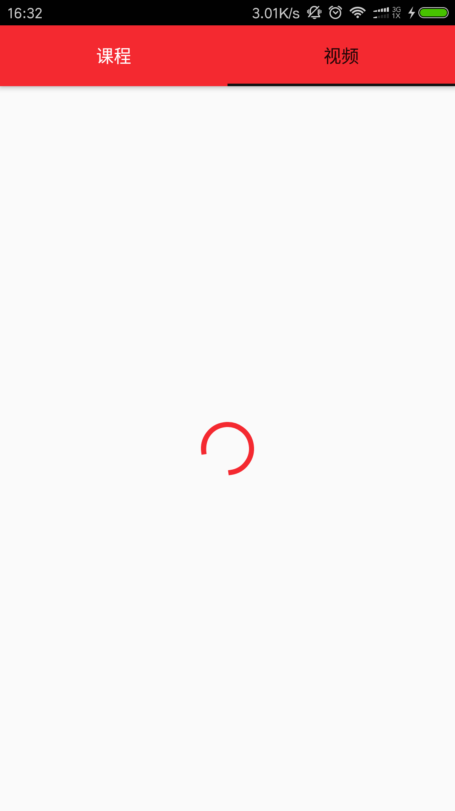
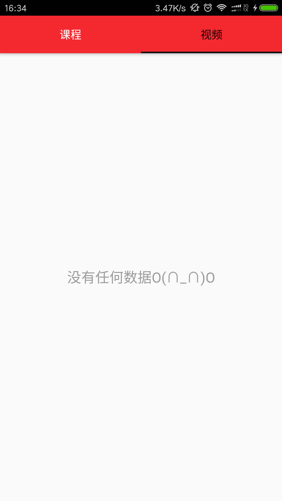
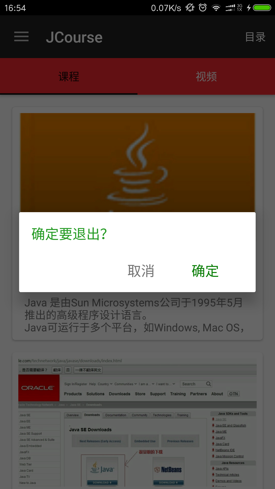
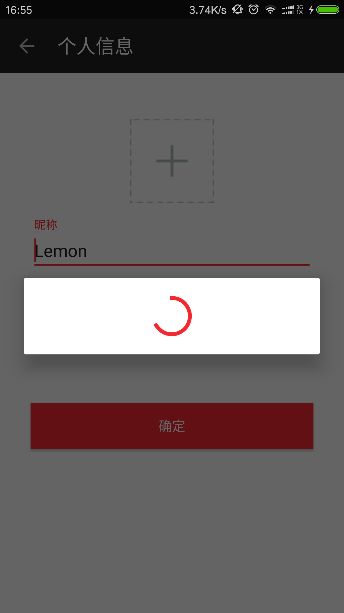

#通用技术 --- Android

> - 开发中的顶级父类，如：SuperActivity,SuperFragment,SuperModel,SuperPresenter
> - 网络当然也是必不可少的，在OkHttp下添加日志拦截器LogInterceptor，添加请求头的拦截器HeadersInterceptor，还有一些用法不好封装成通用，详细看demo
> - UI设计尽量遵循Material Design

##SuperFragment & SuperActivity

###状态页





 - SuperFragment
 ```
 //isUseStatusPages设置是否使用状态页
 public SuperFragment(@LayoutRes int layoutResID, boolean isUseStatusPages)
 ```
状态页显示方法：
  ```
 //显示空状态
 public void showEmpty();
 //显示错误状态
 public void showError();
 //显示加载状态
 public void showLoading();
 //显示正常内容状态
 public void showContent();
  ```

 - SuperActivity
 ```
 //show设置是否使用状态页，必须在setContentView()方法之前调用
 public void useStatusPages(boolean show)
 ```
 状态页显示方法：
  ```
 //显示空状态
 public void showEmpty();
 //显示错误状态
 public void showError();
 //显示加载状态
 public void showLoading();
 //显示正常内容状态
 public void showContent();
  ```

###Dialog




 - SuperFragment

```
//除了这个完整的展示Dialog方法，还有些重载方法，在多次展示不同个Dialog前需先调用dismissDialog()方法
public void showDialog(String title, String content, String positiveText, String passiveText, DialogInterface.OnClickListener positiveListener,
                           DialogInterface.OnClickListener passiveListener)

//消除Dialog
public void dismissDialog()
```

 - SuperActivity

```
//除了这个完整的展示Dialog方法，还有些重载方法，在多次展示不同个Dialog前需先调用dismissDialog()方法
public void showDialog(String title, String content, String positiveText, String passiveText, DialogInterface.OnClickListener positiveListener,
                           DialogInterface.OnClickListener passiveListener)

//消除Dialog
public void dismissDialog()
```

进度条风格Dialog
```
public void showLoadingDialog()
public void dismissLoadingDialog()
```

##SuperPresenter --- MVP模型

>MVP中presenter层的顶级父类，把Activity作为View层

 - 配合SuperActivity使用

在SuperActivity的子类中通过注解声明对应的Presenter
```
@RequirePresenter(JavaCourseUnitListPresenter.class)
public class JavaCourseUnitListActivity extends ToolbarActivity<JavaCourseUnitListPresenter>
```

在SuperPresenter的子类中声明对应的Activity
```
public class JavaCourseUnitListPresenter extends SuperPresenter<JavaCourseUnitListActivity>
```

 - 生命周期

```
//在Activity的onStart之后回调，在Fragment的onCreateView之后回调
public void onCreate(){};

//在Activity的onResume之后回调，在Fragment的onResume中回调
public void onResume(){}

//在view的onDestroy中调用
public void onDestroy(){}
```

 - View层和Presenter层相互调用

presenter中
```
//获取对应的view（activity）
protected V getView();
```
activity中
```
//获取对应的presenter
public P getPresenter()
```

##SuperModel

>MVP中的model层，即数据管理层。
>通常APP中的数据存储或者来源主要通过：本地数据库，网络，SharedPreferences，文件。

 - 基本数据类型：int,long,float,boolean,string...，通过SharedPreferences进行保存，方法：

```
//其他的类似
public void putInt(String key, int value);
public int getInt(String key, int defaultInt);
```

 - 对象（Object）类型通过文件存储

```
public void putObject(String key, Object value);
public Object getObject(String key);
```

>数据库和网络还没有整理封装，后期持续更新。。。

##ToolbarActivity

>继承SuperActivity，拥有SuperActivity的所有特性，此外主要针对带有Toolbar的Activity

 - 在Activity的xml中写入Toolbar
```
<?xml version="1.0" encoding="utf-8"?>
<LinearLayout xmlns:android="http://schemas.android.com/apk/res/android"
    xmlns:tools="http://schemas.android.com/tools"
    android:id="@+id/java_activity_course_unit_list"
    android:layout_width="match_parent"
    android:layout_height="match_parent"
    android:orientation="vertical"
    tools:context="cn.lemon.jcourse.module.java.JavaCourseUnitListActivity">

   <android.support.v7.widget.Toolbar
       android:id="@+id/toolbar"
       android:layout_width="match_parent"
       android:layout_height="wrap_content"
       android:fitsSystemWindows="true"
       android:background="?attr/colorPrimary"
       android:minHeight="?attr/actionBarSize"
       app:theme="@style/ToolbarTheme" />

    <cn.lemon.view.RefreshRecyclerView
        android:id="@+id/recycler_view"
        android:layout_width="match_parent"
        android:layout_height="wrap_content" />

</LinearLayout>
```

**注意**：Toolbar的id必须是`android:id="@+id/toolbar"`。

 - Toolbar相关操作

```
//获取Toolbar
public Toolbar getToolbar()
//设置是否显示做左上角的返回剪头（默认显示）
public void setToolbarHomeBack(boolean isHomeBack)
```

[更多用法请看Demo](https://github.com/llxdaxia/Common/tree/dev/common)